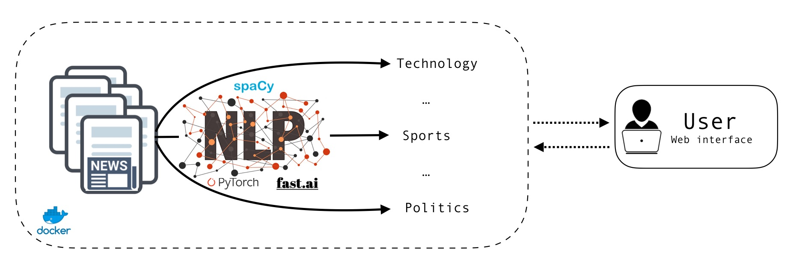
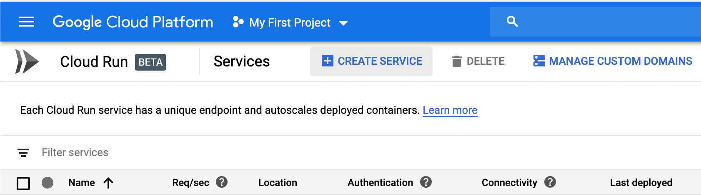
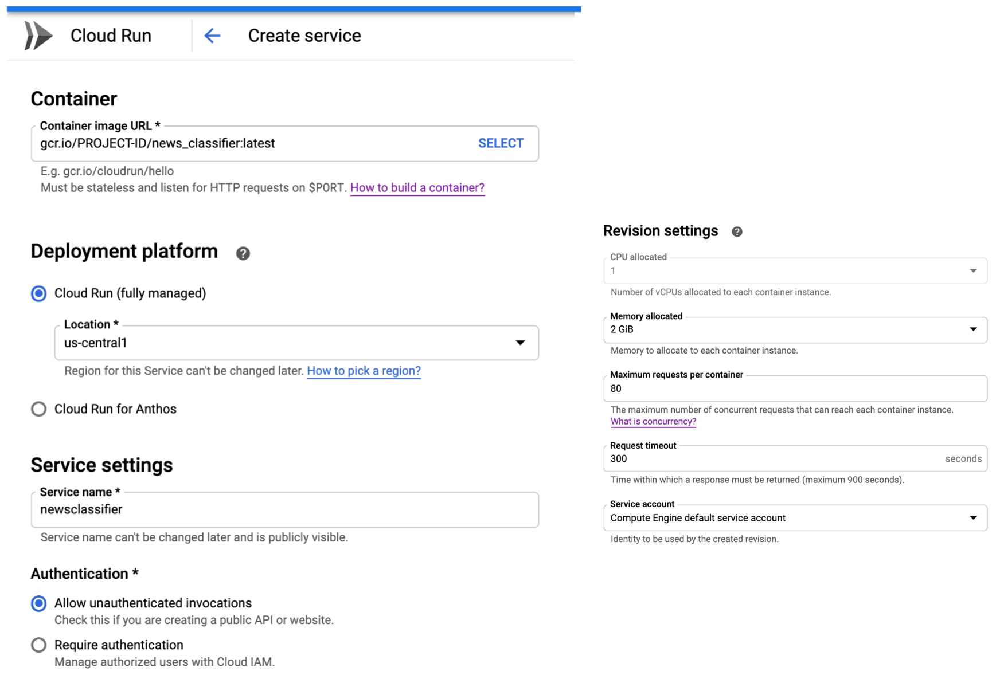

# NLP - News classification
Train and deploy a news classifier based on Logistic Regression.

- Serverless version: https://newsclassification-acv3odjjfa-ew.a.run.app/


# Architecture



# Running on cloud/local machine

To run the application, we can use the pre-build docker image available on Docker Hub and simply run the following command

```bash
docker run --rm -p 8080:8080 ahmedbendebba/news_classification:latest
```

The application will be available on http://0.0.0.0:8080.
The user can run a customized Gunicorn command to specify number of workers or an HTTPS certificate.

```bash
# Get into the container
docker run -it --rm -v ~/nlp:/cert -p 8080:8080 ahmedbendebba/news_classification:latest bash
```

# Serverless deployement - Google Run 

Google Run is a new service from GCP that allows serverless deployment of containers with HTTPS endpoints. The app will run on 1 CPU with 2GB memory and have the ability to scale automatically depending on the number of concurrent requests. 

- Build image and push it to Container Registry 

From a GCP project, we will use Google Shell to build the image and push it to GCR (container registry).

```
# Get name of project 
# For illustration we will call it PROJECT-ID

gcloud config get-value project
```

Create the following Dockerfile in your CloudShell session.

```
FROM ahmedbendebba/news_classification:latest

# Google Run uses env variable PORT 

CMD gunicorn --bind :$PORT wsgi:app
```

Finally, we can build and submit the image to GCR.

```
gcloud builds submit --tag gcr.io/PROJECT-ID/news_classifier
```

- Deploy on Google Run


From Google Run page, we will use the image `gcr.io/PROJECT-ID/news_classifier:latest` to run the app. Create a new service 



Then enter the address of the image, choose other parameters as follows and deploy 


After few seconds,  you will see a link to the app. 


Serverless version may suffer from [**cold-start**](https://github.com/ahmetb/cloud-run-faq#cold-starts) if the service does not receive requests for a long time. 


# Reproduce results

## LR and SVM

- Requirements

To reproduce results reported in the blog post, we need to install the requirements in our development environment.

```bash
# Open requirement.txt and select torch==1.1.0 instead of the cpu version used for inference only.
# Then install requirements
pip install -r requirements.txt
```

- Data 

Run the notebook to save data in the data folder

- Hyper-parameter search

After completing the installation, we can run parameters search or training of sklearn models as follows

```bash
# Params search for SVM
cd sklearn_models
python3 params_search.py --model svc --exp_name svmsearch_all --data dataset_processed

# Params search for LR
python3 params_search.py --model lreg --exp_name logreg_all --data dataset_processed
```

The parameters space is defined in the file `sklearn_models/params_search.py`. The outputs will be saved in the logs folder.

- Training

Training a model for a fixed set of parameters can be done using `sklearn_models/baseline.py`

```bash
# Specify the parameters of the model inside baseline.py and run
python3 baseline.py --model svc --exp_name svc_all --data dataset_processed
```

The logs/metrics on test dataset will be saved in `sklearn_models/logs/` and the trained model will be saved in `sklearn_models/saved_models/`.

Trained model is available for download at: https://github.com/ahmedbendebba1/News-classification-api/releases

---
Ahmed Ben Debba
